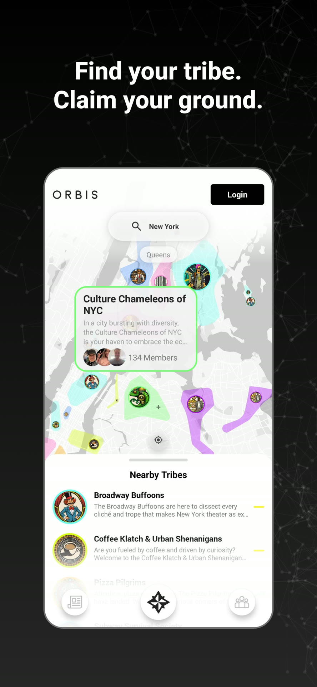
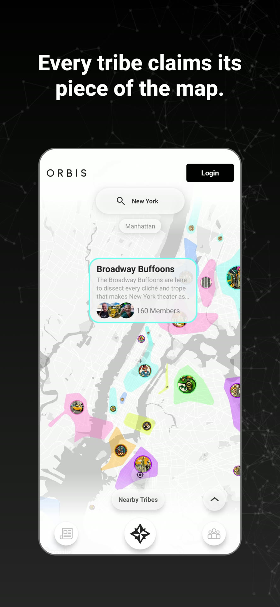
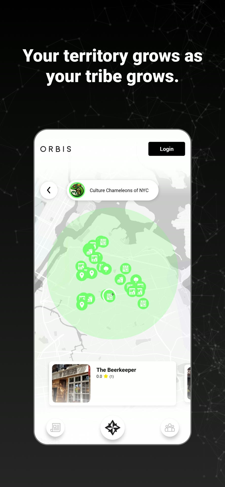
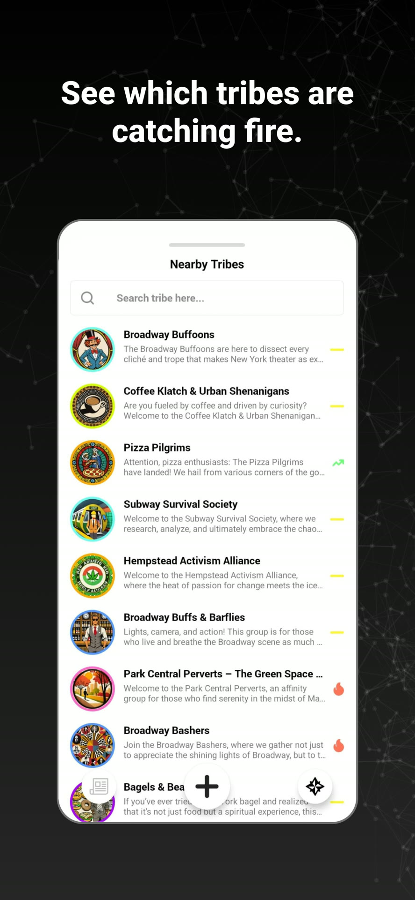
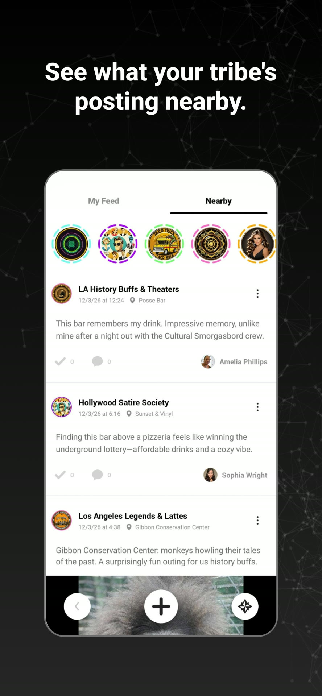
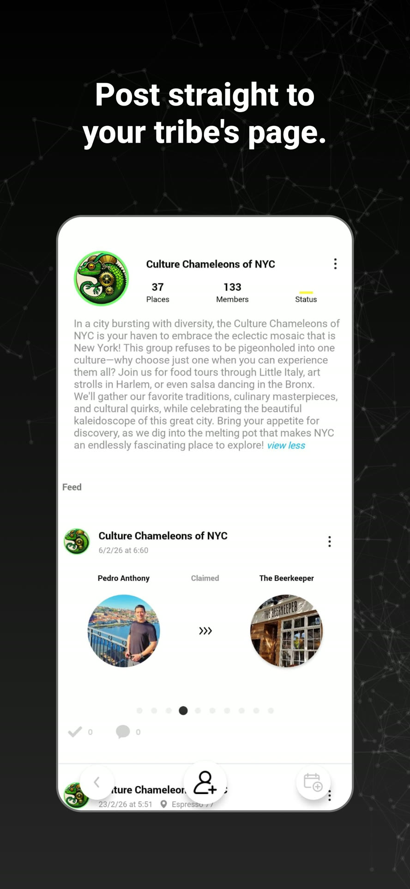
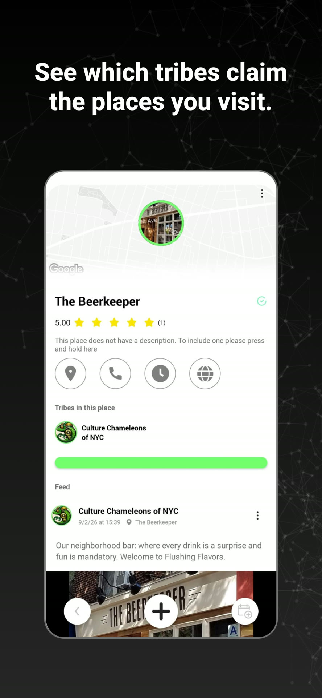
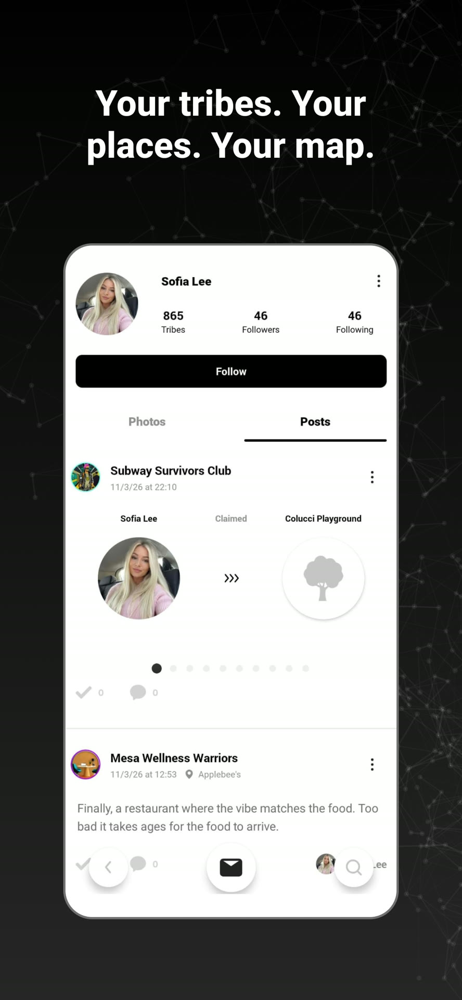

# Orbis iOS

Orbis is a [geosocial network](https://en.wikipedia.org/wiki/Geosocial_networking) built around real-world places and the communities — *tribes* — that claim them. Everything in Orbis lives on the map: you find the tribes near you, claim places and territory for your tribe, and see what your tribe is posting around you. The more your tribe grows, the more ground it holds.

This repository is the **native iOS client** (Swift). It's a thin client that connects to an Orbis backend, so anyone can run their own instance and point the app at it.

<p align="center">
  
  
  
  
</p>
<p align="center">
  
  
  
  
</p>

## What you can do

- **Explore the map** — Discover tribes, places, events, and posts around your current location.
- **Claim territory** — Tribes claim real-world places and grow their territory on the map (the polygon / geohash system). Your territory expands as your tribe grows — no physical check-in required.
- **Tribes** — Create or join tribes, manage members and admins, follow tribes, get recommendations, and moderate (ban / block / report).
- **Places** — Add and follow real-world places, rate them, and see which tribes claim them and what's posted there.
- **Events** — Create events tied to a place or tribe and RSVP / attend.
- **Feed & posts** — A location-aware feed (nearby, your tribe, per-place) with posts, comments, and reactions.
- **Stories** — Share ephemeral stories and view nearby and tribe stories.
- **Messaging** — Direct one-to-one chat with other users.
- **Profiles** — User profiles with tribes, followers / following, and personal activity feeds.
- **Notifications** — Real-time push notifications (Firebase Cloud Messaging).

**Sign-in:** email / password (Firebase Auth), Google, and Sign in with Apple.

## How it works

Orbis is **operator-run**: this app connects to a backend you control (the Orbis Clone Proxy + Java backend) via an `X-Master-Key`. Location is central — your device location places you on the map, and tribes' claimed places and territory are computed server-side as map polygons, so social activity maps onto real geography.

## Tech stack

- **Language:** Swift (UIKit)
- **Architecture:** MVVM — feature modules (ViewModels / ViewControllers / Views)
- **Networking:** Alamofire + URLSession against the Orbis REST API (`NetworkRequestManager`)
- **Local storage:** Realm
- **Maps & location:** Google Maps + Places SDK and device location
- **Auth & push:** Firebase Authentication + Firebase Cloud Messaging (plus Firestore, Storage, Crashlytics, Remote Config)
- **Deep links:** Branch + Firebase Dynamic Links
- **Payments:** Stripe (PaymentSheet) + Apple Pay
- **Dependencies:** CocoaPods — two schemes, **Orbis-iOS** (production) and **Orbis-iOS-Staging**
- **iOS:** 13.0+

## For clone operators — rename the app before publishing

"Orbis" and its branding belong to the original project. If you deploy your own instance, **you must rebrand before shipping** — do not publish it as "Orbis." At minimum, change:

- **App name** — `CFBundleDisplayName` in `Orbis-iOS/Resources/Infolist/Info-prod.plist` / `Info-staging.plist`
- **Bundle identifier** — `PRODUCT_BUNDLE_IDENTIFIER` in the project settings (currently `com.orbis.app` / `com.orbis.orbis.staging`)
- **App icons & branding** — replace the app icons and any in-app logos in `Assets.xcassets`

---

# Orbis iOS — Developer Setup

## Prerequisites

- **Xcode 14+**
- **CocoaPods** (`sudo gem install cocoapods`)
- **A valid `X-Master-Key`** configured by an Orbis Clone Proxy operator (see the secrets table below)

## 1. Install dependencies

```sh
pod install
```

Always open **`Orbis-iOS.xcworkspace`** (not the `.xcodeproj`).

## 2. Configure secrets (required — the app will not run without this)

Secrets (API keys, tokens) are **not committed to git**. They live in local files you create once, ignored by `.gitignore`. This is the iOS equivalent of Android's `local.properties`.

There are two things to set up: the **`.xcconfig` secrets file** and the **Firebase plists**.

### 2a. `Config/Secrets.xcconfig`

Copy the template and fill in the real values:

```sh
cp Config/Secrets.example.xcconfig Config/Secrets.xcconfig
```

Then edit `Config/Secrets.xcconfig`. Each key, what it is, and where to get it:

| Key | What it is | Where to get it |
|-----|-----------|-----------------|
| `X_MASTER_KEY` | Backend master key, sent as the `X-Master-Key` HTTP header on every API request. Same value as Android's `BuildConfig.X_MASTER_KEY` — **a static credential you create yourself**, matching your Java backend's configuration. | Backend team / credentials vault |
| `GOOGLE_API_KEY_STAGING` | Google Maps + Places SDK key for the staging build. | Google Cloud Console → APIs & Services → Credentials (staging project) |
| `GOOGLE_API_KEY_PRODUCTION` | Google Maps + Places SDK key for the production build. | Google Cloud Console → Credentials (production project) |
| `BRANCH_KEY_LIVE` | Branch.io deep-link key, live environment (`key_live_…`). | Branch dashboard → Account Settings |
| `BRANCH_KEY_TEST` | Branch.io deep-link key, test environment (`key_test_…`). | Branch dashboard → Account Settings |

> ⚠️ **Never commit this file.** It is already included in `.gitignore`.

### 2b. Firebase config files (`GoogleService-Info.plist`)

These are also gitignored. Download from the [Firebase Console](https://console.firebase.google.com/) (Project Settings → Your apps → iOS app → `GoogleService-Info.plist`) and place them at:

- Production: `Orbis-iOS/Resources/FirebaseInfolist/Production/GoogleService-Info.plist`
- Staging: `Orbis-iOS/Resources/FirebaseInfolist/Staging/GoogleService-Info.plist`
- Staging (alt): `Orbis-iOS/Resources/FirebaseInfolist/Staging/GoogleService-Info-staging.plist`

`.example.plist` templates sit next to each, showing the expected structure with the API key redacted.

## 3. Run

Pick the **Orbis-iOS** or **Orbis-iOS-Staging** scheme and build.

If secrets are missing, the app crashes at launch with a message telling you which key is absent (see `APPKeys.secret(_:)`).

## How secrets are wired (for maintainers)

`Config/Secrets.xcconfig` → four wrapper xcconfigs in `Config/` (one per build config) `#include` both the CocoaPods xcconfig and `Secrets.xcconfig`, and are set as each config's **base configuration** in the project.

From there:
- Values reach `Info-prod.plist` / `Info-staging.plist` via `$(VARIABLE)` substitution.
- `APPKeys.swift` reads them at runtime with `Bundle.main.object(forInfoDictionaryKey:)`.

To add a new secret: add it to `Secrets.xcconfig` (and `Secrets.example.xcconfig` with a placeholder), reference it as `$(NEW_KEY)` in the relevant Info.plist, then read it via `APPKeys.secret("NEW_KEY")`.

**Never commit** `Config/Secrets.xcconfig` or any real `GoogleService-Info.plist`. Both are gitignored — keep them that way.

## Localization

24 languages. Strings live in `Orbis-iOS/Resources/Strings/<lang>.lproj/Localizable.strings`, looked up through `String.localized` (see `Orbis_String+Extension.swift`).

Translations are ported from the Android project (`orbis_v2_android/app/src/main/res/values-*/strings.xml`) with `Scripts/merge_android_localizations.py`. Rerun it when Android translations change; it matches iOS English-sentence keys against Android English values and only overwrites when the match is unambiguous.
